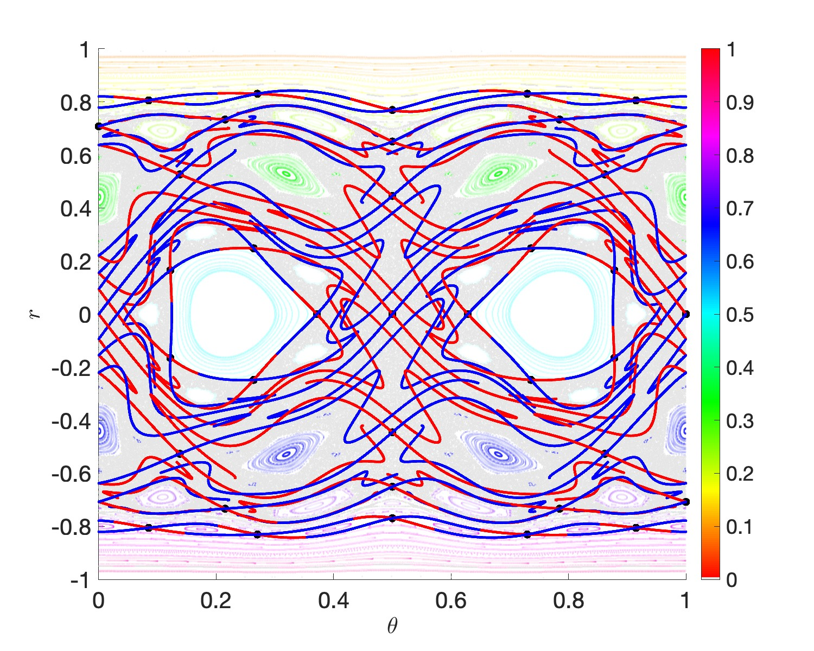
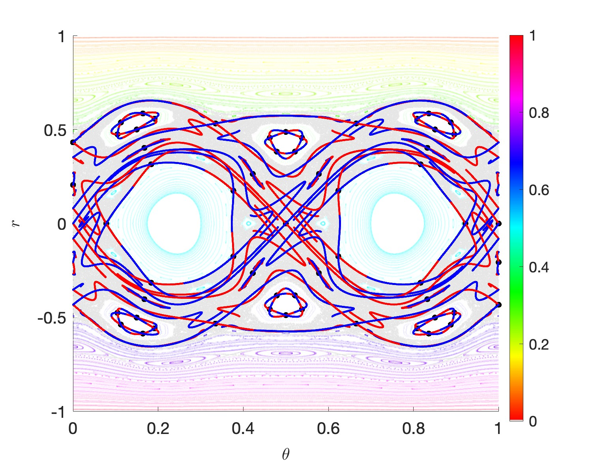

# Billiard Map Dynamics: Periodic Orbits and Invariant Manifolds

## Example Results

### Combined Manifold Visualizations

The figures below show stable (blue) and unstable (red) manifolds for periodic orbits overlaid on phase space dynamics:

<p align="center">
  
  
</p>

**Left**: Table 2 (Two-mode perturbation) showing complex manifold structure  
**Right**: Table 3 (Moderate two-mode perturbation) with periodic orbits of various periods

Color coding: 🔴 Unstable manifolds | 🔵 Stable manifolds | ⚫ Periodic orbit points

## Overview

This repository contains MATLAB code for computing and visualizing periodic orbits and their stable/unstable manifolds in billiard dynamical systems with perturbed boundaries. The implementation uses the parameterization method with Taylor polynomial representations to achieve high-precision numerical results.

## Key Features

- **Periodic Orbit Computation**: Newton iteration methods for locating periodic orbits of various periods (2, 3, 4, 5, 10, 30)
- **Manifold Parameterization**: Rigorous computation of stable and unstable manifolds using conjugacy equations
- **Phase Space Visualization**: Tools for generating phase portraits colored by rotation number
- **Multiple Table Geometries**: Support for 5+ different perturbed billiard table configurations
- **High-Order Accuracy**: Taylor series methods with adaptive degree selection

## Mathematical Background

### Billiard Map
The billiard map describes the dynamics of a point particle bouncing inside a table with perturbed boundary:
```
x(s) = s + Σ aᵢ sin(iπs)
y(t) = t + Σ bᵢ sin(iπt)
```

### Manifold Parameterization
Stable and unstable manifolds are computed by solving functional equations:
- **Unstable**: P(θ) = F(P(μθ)) where μ = 1/λ
- **Stable**: P(μθ) = F(P(θ)) where μ = λ

## Repository Structure
```
├── BilliardIteration/                  # Core billiard map implementations
│   ├── v2rComplex3.m                   # Velocity to momentum (Newton iteration)
│   ├── v2r3.m                          # Velocity to momentum (direct)
│   ├── r2vCOMPLEX3.m                   # Momentum to velocity (Newton iteration)
│   ├── r2v3.m                          # Momentum to velocity (direct)
│   ├── priorv.m                        # Pre-collision velocity reflection
│   ├── RealF3.m                        # Forward billiard map (real)
│   ├── RealF3INV.m                     # Inverse billiard map (real)
│   ├── ComplexF3.m                     # Forward billiard map (complex)
│   ├── BilliardMap.m                   # Main billiard map interface
│   ├── Bill_Table.m                    # Table boundary parametrization
│   ├── dBill_Table.m                   # Table boundary derivative
│   └── Newtons.m                       # Newton solver utilities
│
├── PhasePlotForPaper/                  # Phase space visualization
│   ├── PhasePlotForPaperLOWALPHA.m     # Low alpha transparency version
│   ├── PhasePlotForPaper.m             # Standard phase plot generator
│   └── Extra_info2.m                   # Rotation number computation
│
├── a_Driver_Billiard.m                 # Main driver script
├── MapManifold_Billiard.m              # Manifold computation and visualization
├── a_plot_full_per.m                   # Plot all periods together
├── parmS_FEMap_Billiard.m              # Stable manifold equation residual
├── stableNewton_maps_1var_Billiard.m   # Stable manifold Newton solver
├── unstableNewton_maps_1var_Billiard.m # Unstable manifold Newton solver
├── perK_FPmap_billiard.m               # Period-k fixed point map
├── perK_FPmap_2d_mod.m                 # Period-k map (modified version)
├── parmU_FEMap_Billiard.m              # Unstable manifold equation residual
├── P_comp_lambda_1variable.m           # Parameterization scaling P(λθ)
├── newtonPerK_2dmap_mod.m              # Newton iteration for periodic orbits
├── get_fourier_coeffs_extended.m       # Fourier coefficients of F∘P
├── evaluate_taylor.m                   # Taylor polynomial evaluation
├── BilliardMapOrbit.m                  # Forward orbit computation
├── BilliardMapINVOrbit.m               # Backward orbit computation
│
└── table_X/                            # Data storage (X = 0,1,2,3,4)
    ├── manifoldtab*.mat                # Computed manifold data
    └── manifoldtab*.png                # Manifold visualizations
```

### Key Directories

- **BilliardIteration/**: Contains all core billiard map implementations including forward/inverse maps, coordinate transformations, and boundary definitions
- **PhasePlotForPaper/**: Scripts for generating phase space portraits
- **table_0/ through table_4/**: Output directories storing computed manifolds and visualizations for each table configuration

### File Naming Conventions

- `manifoldtabXperYlevZ.mat`: Manifold data for table X, period Y, level Z
- `manifoldtabXperYlevZ.png`: Corresponding visualization

## Main Codes

### 1. Periodic Orbit Analysis (`a_Driver_Billiard.m`)

**Purpose**: Locate and analyze periodic orbits of specified periods.

**Key Features**:
- Supports periods 2, 3, 4, 5, 10, 30
- Multiple table configurations (Tables 0-4, labeled A-E)
- High-precision Newton refinement
- Initial guess library with documented convergence status

**Usage**:
```matlab
% Uncomment desired table coefficients and periodic orbit parameters
coefx = [1.1, 0.03]; coefy = [1, 0.03];  % Table 0
V = [0.0; 0.5];  % Period-2 orbit initial guess
scale_u = 0.48; scale_s = 0.46; 
per = 2; tablenum = 0; level = 0;

% Run analysis
% (Execute the script after uncommenting parameters)
```

### 2. Manifold Computation (`MapManifold_Billiard.m`)

**Purpose**: Compute stable/unstable manifolds using parameterization method.

**Key Steps**:
1. Generate background phase space
2. Refine periodic orbit with Newton iteration
3. Compute eigenvalues/eigenvectors at periodic orbit
4. Solve conjugacy equations for manifold parameterizations
5. Evaluate and visualize local/global manifolds

**Inputs**:
- `coef`: Boundary Fourier coefficients [2×M]
- `f, Df`: Map and Jacobian function handles
- `X0`: Initial periodic orbit guess [2×per]
- `per`: Period of orbit
- `scale_u, scale_s`: Eigenvector scaling factors
- `tablenum, level`: File naming parameters

**Outputs**:
- PNG visualization of manifolds
- MAT file containing orbit and manifold data

### 3. Visualization (`a_plot_full.m`)

**Purpose**: Load and combine multiple manifold computations for comprehensive visualization.

**Features**:
- Overlays all computed manifolds for a given table
- Color coding: Red (unstable), Blue (stable), Black (periodic points)
- Supports zooming to regions of interest
- High-resolution export (300 DPI)

**Usage**:
```matlab
tablenum = 0;  % Select table
% Adjust axis limits for zooming
axis([0.45, 0.55, -0.1, 0.1]);  % Zoomed view
% or
axis([0, 1, -1, 1]);  % Full view
```

### 4. Phase Space Generator (`PhasePlotForPaper/PhasePlotForPaper.m`)

**Purpose**: Create phase portraits colored by rotation number.

**Features**:
- Computes rotation numbers and digit analysis
- Identifies chaotic vs regular regions
- HSV colormap for rotation number visualization
- Optional transparency for overlapping orbits

**Parameters**:
```matlab
numvals = 100;   % Grid resolution
numits = 2000;   % Iterations per orbit
```

## Core Numerical Methods

### Newton Iteration for Periodic Orbits

**Function**: `newtonPerK_2dmap_mod.m`

Solves the shooting map equation: F^k(X) - X = 0

### Manifold Parameterization Solvers

**Functions**: 
- `stableNewton_maps_1var_Billiard_Per2.m`
- `unstableNewton_maps_1var_Billiard_Per2.m`

**Method**: Newton iteration on conjugacy equations with:
- Adaptive stopping criteria
- Rollback on error increase
- Normalization constraints

**Typical convergence**: 10^-14 in 5-10 iterations

### Taylor Polynomial Evaluation

**Function**: `evaluatetaylor.m`

Evaluates tensor-valued functions in Taylor basis:
```
f(x) = Σ aₐ x₁^α₁ ⋯ xₘ^αₘ
```

Supports interval arithmetic (INTLAB) for rigorous numerics.

## Table Configurations

| Table | Label | Coefficients (x, y) | Description |
|-------|-------|---------------------|-------------|
| 0 | A | [1.1, 0.03], [1, 0.03] | Moderate single-mode |
| 1 | D | [2, 0.04], [1, 0.035] | Strong single-mode |
| 2 | C | [1.1, 0.08, 0.0002], [1, 0.095, 0.0001] | Two-mode |
| 3 | B | [1.1, 0.05, 0.00015], [1, 0.035, 0.0001] | Moderate two-mode |
| 4 | E | [2, 0.05], [1, 0.065] | Strong single-mode |

## Quick Start

### 1. Compute a Periodic Orbit and Manifolds

```matlab
% Add paths
addpath('BilliardIteration/', 'table_0/')

% Define table
coef = [1.1, 0.03; 1, 0.03];

% Set parameters
V0 = [0.0; 0.5];  % Period-2 initial guess
per = 2;
scale_u = 0.48; scale_s = 0.46;

% Run manifold computation
MapManifold_Billiard(coef, @f, @Df, 100, 400, ...
    [-0.1, 1.1, -0.999, 0.999], 0.23, V0, per, ...
    scale_u, scale_s, 6, 0, 0);
```

### 2. Visualize All Manifolds for a Table

```matlab
tablenum = 0;
visualize_manifolds  % Set tablenum inside script
```

### 3. Generate Phase Portrait

```matlab
phaseplane_generator  % Select table inside script
```

## Dependencies

### Required
- MATLAB R2019b or later
- `BilliardMap.m` (core map implementation)
- `RealF3.m`, `ComplexF3.m` (billiard map evaluators)

### Optional
- INTLAB (for interval arithmetic)
- Statistics and Machine Learning Toolbox (for advanced analysis)

### Directory Structure
Create the following directories before running:
```
table_0/, table_1/, table_2/, table_3/, table_4/
BilliardIteration/
```

## Output Files

### Manifold Data (`.mat` files)
Located in `table_X/manifoldtabXperYlevZ.mat`

Contains:
- `X`: Periodic orbit coordinates
- `per`: Period
- `Pu_image`, `Ps_image`: Parameterized manifold points
- `all_orbits_u1`, `all_orbits_s1`: Global manifold points
- `orbits`: Background phase space

### Visualizations (`.png` files)
- Individual manifolds: `table_X/manifoldtabXperYlevZ.png`
- Combined view: `table_X/full_table_X.jpg`
- Phase portraits: `phaseplane0.png`, `phaseplaneLOWALPHA0.fig`

## Coordinate System

- **θ (theta)**: Angular coordinate, periodic with period 1
- **r**: Radial/momentum coordinate in [-1, 1]

Phase space: (θ, r) ∈ [0, 1] × [-1, 1]

## Notes on Numerical Parameters

### NFFT (Taylor Degree)
- Default: 60
- Some configurations require adjustment (e.g., NFFT = 10, 25, 35)
- Higher degree → better accuracy, slower computation

### Scaling Factors (scale_u, scale_s)
- Control manifold initial "scaling" in visualization
- Typical range: 0.1 - 0.7
- Adjust based on eigenvalue magnitude

### Newton Iterations
- Default: 8 iterations for periodic orbits
- Default: 10 iterations for manifold equations
- Convergence typically achieved in 5-10 iterations

## Citation

If you use this code in your research, please cite:

```
[Author information to be added]
[Paper/thesis title]
[Institution/Journal]
[Year]
```

## Acknowledgments

TO BE ADDED

---

**Last Updated**: November 2025
